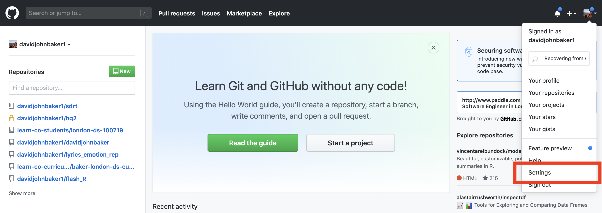
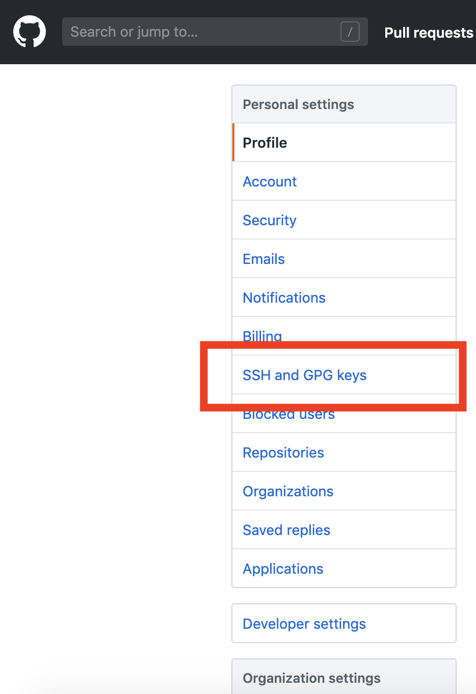
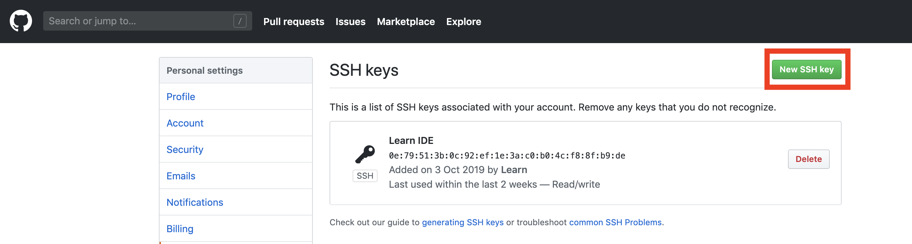
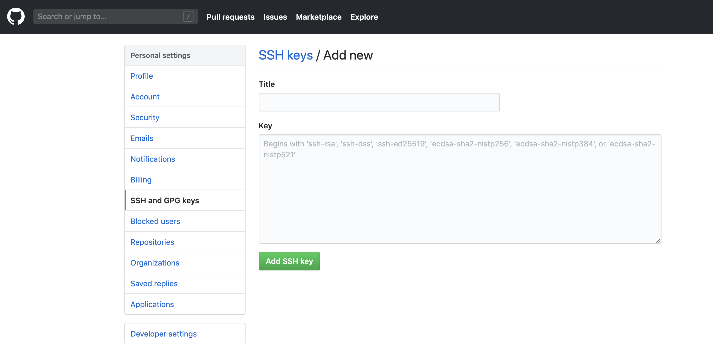

# Tips

## Table of Contents

- [SSH](#ssh)
    + [Check SSH Key](#checking-current-status)
        * [Generate SSH Key](#generate-ssh-key)
        * [Link SSH Key](#link-ssh-key)
- [Helpful Resources](#helpul-resources)
    + [Industry](#industry)
    + [Git](#git)
    + [SQL](#sql)

## SSH

In updating your learn-env, you might get an error that says that you do not have permission to pull a certain repo from Github. The error might look like something like this:

```bash
    Cloning into ‘dsc-data-science-env’...
    The authenticity of host ‘github.com (140.82.118.3)’ can’t be established.
    RSA key fingerprint is SHA256:nThbg6kXUpJWGl7E1IGOCspRomTxdCARLviKw6E5SY8.
    Are you sure you want to continue connecting (yes/no)? yes
    Warning: Permanently added ‘github.com,140.82.118.3’ (RSA) to the list of known hosts.
    git@github.com: Permission denied (publickey).
    fatal: Could not read from remote repository.
    Please make sure you have the correct access rights
    and the repository exists.
```

Getting this error suggests that you have not yet linked your local git with your GitHub account via [ssh](https://en.wikipedia.org/wiki/Secure_Shell).
This tutorial will show you how to fix this problem and explain what each command is doing.

### Checking Current Status

After getting this error, the first thing that you want to do is to double check that there is an ``ssh`` file in your home directory.
You can run this with:

```bash
    ls -a ~/.ssh
```

Confirm that your directory structure is as follows:

```bash
    .ssh
    ├── id_rsa
    ├── id_rsa.pub
    └── known_hosts
```

If the above isn't true (where `id_rsa.pub` is your _public key_ and `id_rsa` is your _private key_), you have to create a keypair of your own ([generate key](#generate-key)). If you do have the above or something similar, then you might just need to link/add your key on Github ([link key](#link-key)).

### Generate SSH Key

Assuming there are no pre-existing keys on your system [checking your ssh key](#check-ssh-key), the first thing you need to do is to generate an ssh key. You can do this by running the following command.

```bash
    ssh-keygen -t rsa -b 4096 -C "your_email@example.com"
```

Press ``<RETURN>`` when prompted, the defaults will do just fine.

This will create a key that you will use to authorise your local computer when accessing remote server resources.
Note that this makes both a **PUBLIC** and a **PRIVATE** key. You *never* want to give out/share your **PRIVATE** key, only your **PUBLIC** key.

With our key generated with the command above, we can now copy the contents of ``id_rsa.pub`` to our clipboard with the command:

```bash
    pbcopy < ~/.ssh/id_rsa.pub
```

This basically copies the contents of ``id_rsa.pub`` to your clipboard in your command line. With this now in our clipboard, we then go to Github to finish our linking.

Type in `man ssh-keygen` to learn more about the ssh-keygen tool.

Type in `man pbcopy` to learn more about the pbcopy tool.

Read more about SSH and Github [here](https://help.github.com/en/github/authenticating-to-github/connecting-to-github-with-ssh).

### Link SSH Key

Next, we navigate to [Github.com](www.github.com) and need to first go to Settings, then click the side panel that is SSH and GPG Keys. From here, click the Green SSH key. The following screenshots can direct your clicking!







From this screen, you then want to right click and paste the contents of your clipboard to this text field.
You can also give this a title so you can keep track of your keys and what local computers that belongs to.

Once you then save this, you can then test that it works by running


### Test SSH Key

We can now test our SSH Key and see if it works! Github has a very handy ssh 'handshake' that we can use by running the following in our terminals.

```bash
    ssh -t git@github.com
```

Accept the prompt to add a new key to your known hosts by pressing `<RETURN>`.


The above will confirm to you that your local computer can now communicate with your GitHub account by saying something like the following:

```bash
    Hi <your GitHub username>! You've successfully authenticated, but GitHub does not provide shell access.
```

## Helpful Resources

### Industry

- [Data Machina](https://datamachina.substack.com/)
- [Towards Data Science](https://towardsdatascience.com/)
- [KD Nuggets](https://www.kdnuggets.com/)
- [Analytics Vidya](https://www.analyticsvidhya.com/)
- [The Algorithm](https://forms.technologyreview.com/the-algorithm/)
- [Becoming a Data Scientist](http://www.becomingadatascientist.com/)
- [Variance Explained](http://varianceexplained.org/posts/)
- [Daniel Lakens](http://daniellakens.blogspot.com/)
- [The Deepmind Podcast](https://deepmind.com/blog/article-welcome-to-the-deepmind-podcast)
- [Data Science Blogs](https://github.com/rushter/data-science-blogs)

### Git

- https://www.atlassian.com/git
- https://try.github.io/
- https://learngitbranching.js.org/
- https://git-scm.com/docs/

### SQL

- https://mode.com/sql-tutorial/
- https://sqlbolt.com/
