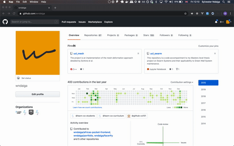
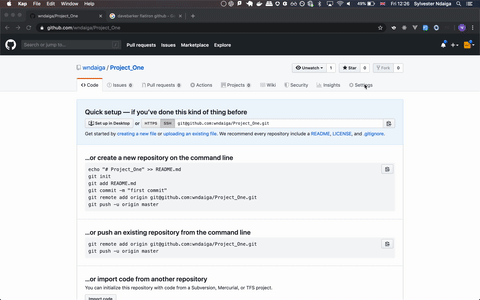

# Projects

## Table of Contents

- [Introduction](#introduction)
- [Project Structure](#project-structure)
- [Project Workflow](#project-workflow)
- [Project Issues](#project-issues)
  * [Merge Conflicts](#merge-conflicts)

## Introduction

This doc details how we expect you to collaborate on your paired projects:

Whenever possible, pair program through your code development. You can do this by physically meeting or over a video call.

You are expected to know/abide by the following when working collaboratively on a github project:

1. There can only be one **maintainer** of a project with anyone else referred to as a **collaborator**.
2. The maintainer of a project owns the github repository under which the project lies.
3. Collaborators should only ever clone (not **fork**!!) the github project.

We suggest a basic shared repository workflow that works as follows:

## Project Structure

There are numerous ways to setup a DS project with pros and cons to each. We have elected to recommend the following
structure for it's simplicity. For a deeper look into setting up your projects (especially after Mod 3), please have a read through this
article on creating [Data Science Portfolios](https://www.dataquest.io/blog/build-a-data-science-portfolio/) and [this](https://drivendata.github.io/cookiecutter-data-science/#directory-structure) for a high-quality project template.

1. Install Git LFS - [instructions](https://git-lfs.github.com/).
2. Add the gitignore.io service as an alias to your local git installation - [instructions](https://docs.gitignore.io/install/command-line).
3. Create your project directory by copying and running the following (*line by line*) in your terminal:

```bash
    mkdir projects/<project name>
    cd <project name>
    git ignore python,pydev,macos,windows,pydev,sublimetext,visualstudiocode > .gitignore
    git lfs install
    git lfs track "*.sqlite"
    git lfs track "*.csv"
    git add .gitignore .gitattributes
    git commit -m "initial project setup"
```

4. _*_ Create a github repository (you can/should name it more appropriately) which will be used as your project's remote git location.



5. _*_ Add your project partner as a collaborator and slack them a copy to the invite link (this won't work until they accept this invite).
6. Copy and run the following code in your terminal. Replace `<github remote url>` with the **git url** to your github project and make sure you're in your project directory, use the `pwd` command to confirm. 

```bash
    git remote add origin <github remote url>
    git push -u origin master
```

_*_ Steps 4 & 5 are only to be performed by the maintainer of the project.



## Project Workflow

1. Each pair member creates a working branch with `git checkout -b <YourNewBranch>`.
2. Make your changes on your branch and stage them with `git add .` .
3. Commit your changes locally with `git commit -m "<description of your commit>"` .
4. Upload/Push your changes (including your new branch) to GitHub with `git push -u origin <YourNewBranch>` .
5. Go to the main repo on GitHub where you should now see your new branch on the branch dropdown menu.
6. Create a Pull Request as a contributor.


7. _*_ The maintainer should then review the pull requests and confirm there are no merge conflicts by going to the Pull Requests pane (located under the repository name).
8. _*_ The maintainer can then open the create pull request and merge it to the master by clicking the Merge Pull Request button at the bottom of the page.
9. All pair members must then checkout into their master branch (using `git checkout master`) and pull the new changes down to their local repositories (using `git pull`) once pull requests have been merged to master.
10. At this point you will want to update your branch with the new code by doing a checkout into your branch (using `git checkout <YourBranchName>`) and merging the master (using `git merge master`).
11. Repeat from 2!

_*_ Steps 7 & 8 are only to be performed by the maintainer of the project.

Read more about how to pair program [here](https://gds.blog.gov.uk/2018/02/06/how-to-pair-program-effectively-in-6-steps/).

If you’d like to work on your projects over a video call,we would recommend [discord](https://discordapp.com/) and/or VSCode. The latter has a live share feature allowing for remote collaborative coding [VSCode ](https://code.visualstudio.com/blogs/2017/11/15/live-share).

## Project Issues

### Merge conflicts

You may stumble on a number of merge conflicts when dealing with Jupyter notebooks. We recommend using [sublime merge](https://www.sublimemerge.com/) to fix these. Approach your instructor/coach to learn how to fix these.
